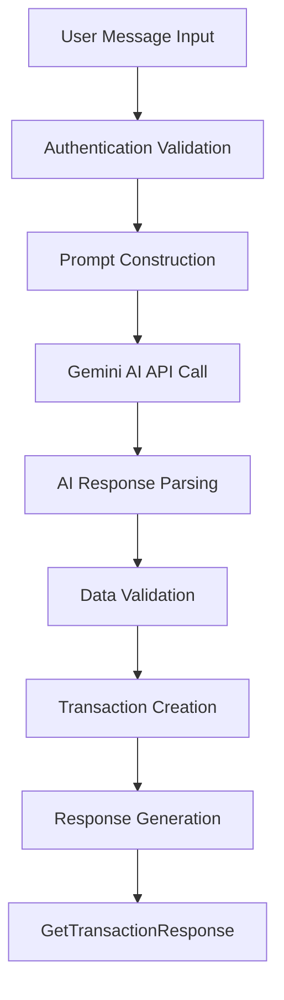

# AI-Powered Transaction Creation Feature - Product Requirements Document

## 1. Product Overview

This feature enables users to create financial transactions using natural language messages, leveraging Google Gemini AI to parse and extract transaction details automatically. Users can simply describe their expense in plain text, and the system will intelligently create a structured transaction record.

- **Problem to solve**: Simplify transaction entry by eliminating manual form filling and reducing user friction in expense tracking.
- **Target users**: Existing MoneyTrack users who want faster, more intuitive transaction creation.
- **Value proposition**: Reduce transaction creation time by 70% and improve user engagement through conversational interface.

## 2. Core Features

### 2.1 User Roles

| Role | Registration Method | Core Permissions |
|------|---------------------|------------------|
| Authenticated User | Existing MoneyTrack authentication | Can create transactions via AI message parsing |

### 2.2 Feature Module

Our AI transaction creation feature consists of the following main components:
1. **Message Input Interface**: Natural language message submission endpoint
2. **AI Processing Engine**: Gemini AI integration for message parsing
3. **Transaction Creation**: Automated transaction record generation
4. **Response Delivery**: Structured transaction response to user

### 2.3 Page Details

| Component | Module Name | Feature Description |
|-----------|-------------|---------------------|
| API Endpoint | Message Processing | Accept natural language messages, validate user authentication, initiate AI processing workflow |
| AI Integration | Gemini Parser | Build structured prompts, call Gemini API, parse JSON responses, handle AI service errors |
| Transaction Engine | Data Processing | Map AI results to transaction models, validate extracted data, create transaction records |
| Response Handler | Result Delivery | Format transaction data, return GetTransactionResponse, handle error scenarios |

## 3. Core Process

**User Flow:**
1. User sends POST request to `/api/transactions/ai-create` with natural language message
2. System validates authentication and message format
3. System constructs prompt and sends to Gemini AI API
4. Gemini returns structured JSON with transaction details
5. System validates and maps AI response to transaction model
6. System creates transaction record in database
7. System returns GetTransactionResponse with created transaction

## 4. User Interface Design

### 4.1 Design Style
- **Primary colors**: Consistent with existing MoneyTrack API design
- **Response format**: JSON-based RESTful API responses
- **Error handling**: Structured error responses with clear messaging
- **Validation**: Input validation for message length and content

### 4.2 API Design Overview

| Endpoint | Method | Purpose | Request Format | Response Format |
|----------|--------|---------|----------------|------------------|
| `/api/transactions/ai-create` | POST | Create transaction from natural language | `{"message": "string"}` | `GetTransactionResponse` |

### 4.3 Integration Requirements

- **Authentication**: Leverage existing JWT authentication system
- **Database**: Use existing transaction and category entities
- **Error handling**: Follow existing exception handling patterns
- **Logging**: Implement comprehensive logging for AI interactions and debugging
