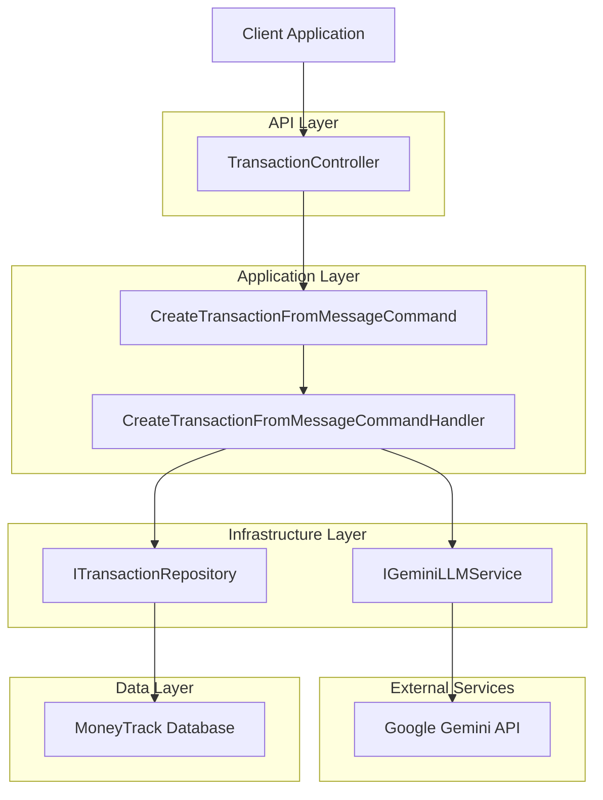
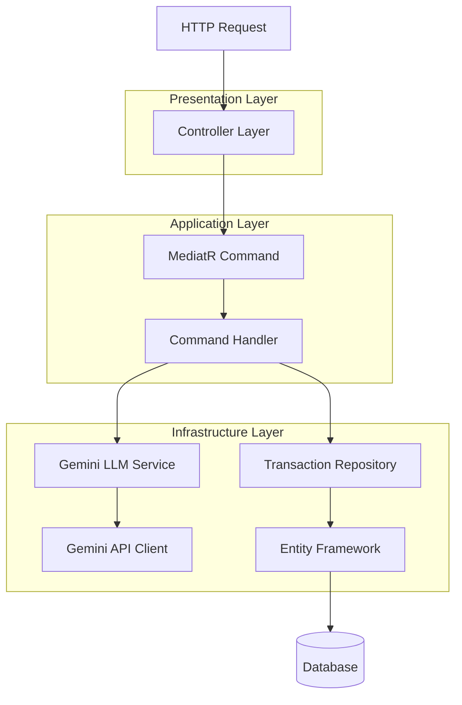

# AI-Powered Transaction Creation - Technical Architecture Document

## 1. Architecture Design



## 2. Technology Description

* **Frontend**: Existing client applications (React/Mobile)

* **Backend**: ASP.NET Core 8 + MediatR + Clean Architecture

* **AI Integration**: Google Gemini API via HTTP client

* **Database**: Existing PostgreSQL with Entity Framework Core

* **Authentication**: Existing JWT-based authentication

## 3. Route Definitions

| Route                         | Method | Purpose                                          | Authentication |
| ----------------------------- | ------ | ------------------------------------------------ | -------------- |
| `/api/transactions/ai-create` | POST   | Create transaction from natural language message | Required (JWT) |

## 4. API Definitions

### 4.1 Core API

**AI Transaction Creation**

```
POST /api/transactions/ai-create
```

Request:

| Param Name | Param Type | isRequired | Description                                     |
| ---------- | ---------- | ---------- | ----------------------------------------------- |
| message    | string     | true       | Natural language description of the transaction |

Request Example:

```json
{
  "message": "I spent $25.50 on lunch at McDonald's today"
}
```

Response:

| Param Name   | Param Type              | Description                               |
| ------------ | ----------------------- | ----------------------------------------- |
| success      | boolean                 | Indicates if the operation was successful |
| message      | string                  | Success or error message                  |
| transactions | List<GetTransactionDto> | List containing the created transaction   |

Response Example:

```json
{
  "success": true,
  "message": "Transaction created successfully",
  "transactions": [
    {
      "id": "123e4567-e89b-12d3-a456-426614174000",
      "description": "Lunch at McDonald's",
      "amount": 25.50,
      "expenseDate": "2024-01-15T12:30:00Z",
      "userId": "user-guid",
      "category": {
        "code": "FOOD",
        "name": "Food & Dining"
      }
    }
  ]
}
```

### 4.2 Gemini AI Integration

**Internal Service Interface**

```csharp
public interface IGeminiLLMService : ILLMService<CreateTransactionRequest>
{
    Task<CreateTransactionRequest> ParseMessageToTransactionAsync(string message, Guid userId);
}
```

**Gemini API Request Format**

```json
{
  "contents": [{
    "parts": [{
      "text": "Parse this transaction message and return JSON: 'I spent $25.50 on lunch at McDonald's today'"
    }]
  }],
  "generationConfig": {
    "response_mime_type": "application/json",
    "response_schema": {
      "type": "object",
      "properties": {
        "description": {"type": "string"},
        "amount": {"type": "number"},
        "expenseDate": {"type": "string"},
        "categoryCode": {"type": "string"}
      }
    }
  }
}
```

## 5. Server Architecture Diagram



## 6. Data Models

### 6.1 New Command and Response Models

**CreateTransactionFromMessageCommand**

```csharp
public class CreateTransactionFromMessageCommand : IRequest<GetTransactionResponse>
{
    public string Message { get; set; }
    public Guid UserId { get; set; } // From JWT claims
}
```

**Gemini Response Model**

```csharp
public class GeminiTransactionResponse
{
    public string Description { get; set; }
    public double Amount { get; set; }
    public DateTime ExpenseDate { get; set; }
    public string CategoryCode { get; set; }
}
```

### 6.2 Service Configuration

**Gemini Service Configuration**

```json
{
  "GeminiSettings": {
    "ApiKey": "your-gemini-api-key",
    "BaseUrl": "https://generativelanguage.googleapis.com/v1beta",
    "Model": "gemini-1.5-flash",
    "MaxTokens": 1000,
    "Temperature": 0.1
  }
}
```

### 6.3 Prompt Template

```csharp
public static class GeminiPromptTemplates
{
    public const string TransactionParsingPrompt = @"
        Parse the following transaction message and extract the transaction details.
        Return a JSON object with the following structure:
        {
            ""description"": ""brief description of the transaction"",
            ""amount"": numeric_amount,
            ""expenseDate"": ""ISO_date_string"",
            ""categoryCode"": ""category_code""
        }
        
        Available category codes: FOOD, TRANSPORT, SHOPPING, ENTERTAINMENT, UTILITIES, HEALTHCARE, OTHER
        
        If the date is not specified, use today's date.
        If the category cannot be determined, use 'OTHER'.
        
        Message to parse: {0}
        ";
}
```

## 7. Implementation Components

### 7.1 Required New Files

1. **Commands**

   * `CreateTransactionFromMessageCommand.cs`

   * `CreateTransactionFromMessageCommandHandler.cs`

   * `CreateTransactionFromMessageCommandValidator.cs`

2. **Services**

   * `IGeminiLLMService.cs`

   * `GeminiLLMService.cs`

   * `GeminiSettings.cs`

3. **Models**

   * `CreateTransactionFromMessageRequest.cs`

   * `GeminiTransactionResponse.cs`

4. **Controller Updates**

   * Add new endpoint to `TransactionController.cs`

### 7.2 Configuration Updates

1. **Dependency Injection**

   * Register `IGeminiLLMService` in `InfrastructureServiceRegistration.cs`

   * Configure HTTP client for Gemini API

2. **Settings**

   * Add Gemini configuration to `appsettings.json`

   * Add environment-specific settings for API keys

### 7.3 Error Handling Strategy

1. **Gemini API Failures**

   * Implement retry logic with exponential backoff

   * Fallback to manual transaction creation

   * Log all API interactions for debugging

2. **Parsing Failures**

   * Validate JSON response structure

   * Handle malformed AI responses gracefully

   * Provide meaningful error messages to users

3. **Validation Errors**

   * Validate extracted transaction data

   * Check category code validity

   * Ensure amount and date formats are correct

## 8. Security Considerations

1. **API Key Management**

   * Store Gemini API key in secure configuration

   * Use environment variables for production

   * Implement key rotation strategy

2. **Input Validation**

   * Sanitize user messages before sending to AI

   * Limit message length to prevent abuse

   * Validate user authentication for all requests

3. **Rate Limiting**

   * Implement rate limiting for AI API calls

   * Monitor usage to prevent quota exhaustion

   * Cache common parsing results when appropriate

