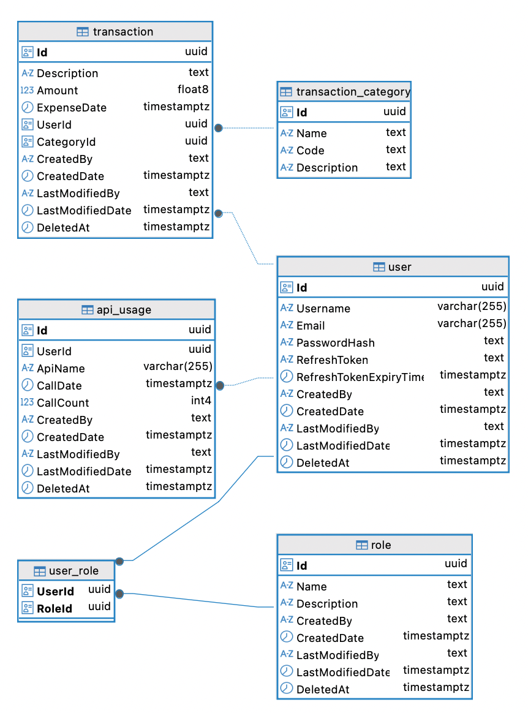

# MoneyTrack - Clean Architecture Implementation

A comprehensive financial tracking application built with .NET 9.0 following Clean Architecture principles. This project demonstrates modern software development practices including CQRS, Domain-Driven Design, and proper separation of concerns.

## 📚 Documentation

This project documentation is organized into three main sections:

### 🏗️ [ARCHITECTURE](./ARCHITECTURE.md)

Detailed technical documentation covering:

- Clean Architecture implementation
- Project structure and layers
- Technology stack and frameworks
- Database design and patterns
- Security architecture
- Performance optimization
- CI/CD pipeline

### 💼 [BUSINESS](./BUSINESS.md)

Business-focused documentation including:

- Application overview and vision
- Core features and capabilities
- AI integration with Google Gemini
- User experience design
- Business value proposition
- Competitive advantages

### 🚀 [GUIDELINE](./GUIDELINE.md)

Practical setup and development guide:

- Prerequisites and installation
- Configuration setup
- Database and AI service setup
- Running and testing procedures
- Development workflow
- Troubleshooting and deployment

---

## Quick Start

For immediate setup, see the [GUIDELINE](./GUIDELINE.md) documentation.

For understanding the business context, start with [BUSINESS](./BUSINESS.md).

For technical deep-dive, explore [ARCHITECTURE](./ARCHITECTURE.md).

## 📄 License

[Add your license information here]
